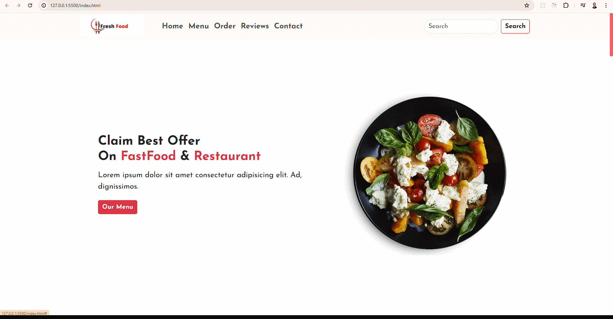

# Fast Food Website

## Description

This project is a responsive fast food website created using HTML and CSS. It features a clean and appealing design, providing information about the menu, special offers, and contact details.

## Technologies Used

- HTML
- CSS

## Features

- **Responsive Design:** The website is fully responsive and works well on all devices.
- **Attractive Interface:** Simple and appealing layout for easy navigation.
- **Comprehensive Information:** Includes sections for menu, special offers, and contact information.

## How to Use

1. Clone the repository:
   ```bash
   git clone https://github.com/yourusername/fast-food-website.git
   ```
Open the index.html file in your browser to view the website.

## GIF



## Link

[Visit the Fast Food Website](https://662a8e82e8b007201be145b5--startling-meerkat-3e639e.netlify.app/)
